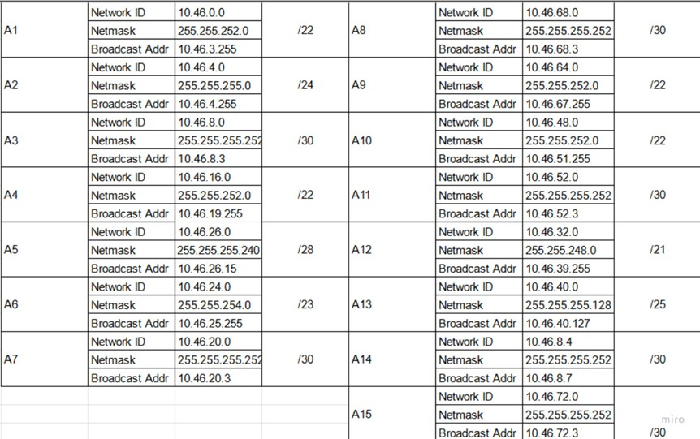
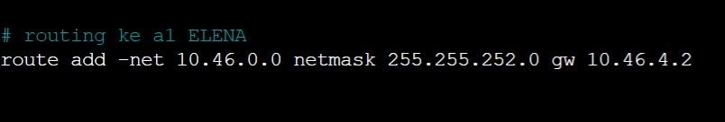

# Jarkom-Modul-4-T09-2021

Nama Anggota | NRP
------------------- | --------------		
Natasya Abygail N | 05111940000020
Muhammad Hilmi Ramadhan | 05311940000044
Sri Puspita Dewi | 05111940000045

## List of Contents :
- [VLSM](#vlsm)
	- [Jawaban](#jawaban-soal-vlsm)
- [CIDR](#cidr)
	- [Jawaban](#jawaban-soal-cidr)

Berikut merupakan soal topologi yang diberikan dimana kami diminta untuk menyelesaikannya dalam `Subnetting` dengan dua metode yaitu `VLSM` dan `CIDR`.


<br>

## Catatan
---
1. VLSM dikerjakan di Cisco Packet Tracer
2. CIDR dikerjakan di GNS3
3. Prefix IP menggunakan `10.46.0.0`

Detil soal dapat dilihat pada [tautan ini](https://docs.google.com/document/d/1hf5Vi5nbEq6YY-nqmK7XUTHGNL_KVEFVc14mW9k0FAg/edit)

## VLSM
---
Buatlah penyelesaian subnetting dengan metode VLSM dari topologi yang diberikan!

## Jawaban Soal VLSM 
---
Pertama-tama kami membuat pembagian subnet terhadap topologi soal.


<br>

Dari hasil pembagian subnet diketahui terdapat sejumlah **15 Subnet**

### Perhitungan VLSM
1. Menentukan jumlah alamat IP yang dibutuhkan oleh tiap subnet dari 15 subnet yang ada 	

   | Subnet | Jumlah IP | Netmask |
   | :---:  | :---:     | :---:   |
   | A1     | 721       | /22     |
   | A2     | 252       | /24     | 
   | A3     | 2         | /30     | 
   | A4     | 521       | /22     |  
   | A5     | 13        | /28     |  
   | A6     | 502       | /23     |  
   | A7     | 2         | /30     |  
   | A8     | 2         | /30     |  
   | A9     | 1001      | /22     |  
   | A10    | 701       | /22     |  
   | A11    | 2         | /30     |  
   | A12    | 2021      | /21     |  
   | A13    | 101       | /25     |   
   | A14    | 2         | /30     |   
   | A15    | 2         | /30     |   
   | **Total**   | **5845**    | **/19**     | 

2. Subnet besar yang kami bentuk memiliki NID 10.46.0.0 dengan netmask /19. Lalu, kita mulai dengan perhitungan pembagian IP dengan bantuan pohon IP seperti gambar berikut:

Sehingga pembagian IP yang memungkinkan dalam topologi seperti gambar berikut:

<br>

3. Setting IP untuk masing-masing interface yang ada di setiap device sesuai dengan pembagian subnet pada pohon VLSM. Interface dapat diatur pada menu Config > INTERFACE > “nama interface” pada `Cisco Packet Tracerr`
- FOOSHA (Sebagai Router)
	- IP pada interface FOOSHA yang mengarah ke CLOUD `(Fa0/0)`
	/foosha_cloud.jpg)
	- IP pada interface FOOSHA yang mengarah ke BLUENO (1000 Host) `(Fa0/1)`
	/foosha_blueno.jpg)
	- IP pada interface FOOSHA yang mengarah ke WATER7 `(Eth1/0)`
	/foosha_water7.jpg)
	- IP pada interface FOOSHA yang mengarah ke GUANHAO `(Eth1/2)`
	/foosha_guanhao.jpg)
	- IP pada interface FOOSHA yang mengarah ke DORIKI Server `(Eth1/1)`
	/foosha_doriki.jpg)

   - Routing menuju **A9** dengan NID `10.46.8.0/22` via `10.46.8.2`, menuju **A10** dengan NID `10.46.12.0/22` via `10.46.27.154`, menuju **A15** dengan NID `10.46.27.172/30` via `10.46.27.174`, menuju **A12** dengan NID `10.46.0.0/21` via `10.46.27.154`:
   /staticroute1.jpg)
  
   - Routing menuju **A13** dengan NID `10.46.27.0/25` via `10.46.27.154`, menuju **A4** dengan NID `10.46.20.0/22` via `10.46.27.150`, menuju **A6** dengan NID `10.46.24.0/23` via `10.46.27.150`, menuju **A5** dengan NID `10.46.27.128/28` via `10.46.27.150`:
   /staticroute2.jpg)
  
   - Routing menuju **A14** dengan NID `10.46.27.168/30` via `10.46.27.150`, menuju **A2** dengan NID `10.46.26.0/24` via `10.46.27.150`, menuju **A1** dengan NID `10.46.16.0/22` via `10.46.27.150`:
   /staticroute3.jpg)

- BLUENO (Sebagai Klien)
	- IP pada Configuration Blueno yang mengarah ke FOOSHA `(Fa0)`
	/bluenoconf.jpg)

- DORIKI (Sebagai Server)
	- IP pada Configuration Doriki yang mengarah ke FOOSHA `(Fa0)`
	/dorikiconf.jpg)

- WATER7 (Sebagai Router)
	- IP pada interface WATER7 yang mengarah ke FOOSHA `(Fa0/0)`
	/water7_foosha.jpg)

	- IP pada interface WATER7 yang mengarah ke PUCCI `(Fa0/1)`
	/water7_pucci.jpg)

	- IP pada interface WATER7 yang mengarah ke WATER7 `(Fa1/0)`
	/water7_cipher.jpg)

   - Routing menuju **A12** dengan NID `10.46.0.0/21` via `10.46.27.153`, menuju **A13** dengan NID `10.46.27.0/25` via `10.46.27.162`, dan untuk mengijinkan segala aktivitas paket yang menuju ke FOOSHA melalui **A8** dengan NID `0.0.0.0/0` via `10.46.27.153`:
   /staticroute.jpg)

	
- CIPHER (Sebagai Klien)
	- IP pada Configuration CIPHER yang mengarah ke WATER7 `(Fa0)`
	/cipherconf.jpg)
	

- PUCCI (Sebagai Router)
	- IP pada interface PUCCI yang mengarah ke WATER7 `(Fa0/0)`
	/pucci_water7.jpg)

	- IP pada interface PUCCI yang mengarah ke CALMBELT dan COURT YARD `(Fa0/1)`
	/pucci_calmbelt_courtyard.jpg)

	- IP pada interface PUCCI yang mengarah ke JIPANGU `(Fa1/0)`
	/pucci_jipangu.jpg)

   - Routing untuk mengijinkan segala aktivitas paket yang menuju ke Water7 yang nantinya akan diteruskan ke FOOSHA melalui **A11** dengan NID `0.0.0.0/0` via `10.46.27.161`:
   /staticroute.jpg)

- GUANHAO (Sebagai Router)
	- IP pada interface GUANHAO yang mengarah ke FOOSHA `(Fa1/1)`
	/guanhao_foosha.jpg)

	- IP pada interface GUANHAO yang mengarah ke JABRA `(Fa0/0)`
	/guanhao_jabra.jpg)

	- IP pada interface GUANHAO yang mengarah ke MAINGATE dan ALABASTA `(Fa0/1)`
	/guanhao_maingate_alabasta.jpg)

	- IP pada interface GUANHAO yang mengarah ke OIIMO `(Fa1/0)`
	/guanhao_oiimo.jpg)

   - Routing untuk mengijinkan segala aktivitas paket yang menuju ke FOOSHA melalui **A7** dengan NID `0.0.0.0/0` via `10.46.27.149`,  menuju **A5** dengan NID `10.46.27.128/28` via `10.46.24.2`,  menuju **A14** dengan NID `10.46.27.168/30` via `10.46.27.146`,  menuju **A2** dengan NID `10.46.26.0/24` via `10.46.27.146`,  menuju **A1** dengan NID `10.46.16.0/22` via `10.46.27.146` :
   /staticroute1.jpg)
   /staticroute2.jpg)

- JABRA (Sebagai Klien)
	- IP pada Configuration JABRA yang mengarah ke GUANHAO `(Fa0)`
	/jabraconf.jpg)

- MAINGATE (Sebagai Klien)
	- IP pada Configuration MAINGATE yang mengarah ke GUANHAO `(Fa0)`
	/maingateconf.jpg)

- ALABASTA (Sebagai Router)
	- IP pada interface ALABASTA yang mengarah ke GUANHAO `(Fa0/0)`
	/alabasta_guanhao.jpg)

	- IP pada interface ALABASTA yang mengarah ke JORGE `(Fa0/1)`
	/alabasta_jorge.jpg)

   - Routing untuk mengijinkan segala aktivitas paket yang menuju ke FOOSHA melalui **A6** dengan NID `0.0.0.0/0` via `10.46.24.1`:
   /staticroute.jpg)

- JORGE (Sebagai Klien)
	- IP pada Configuration JORGE yang mengarah ke ALABASTA `(Fa0)`
	/jorgeconf.jpg)

- OIIMO (Sebagai Router)
	- IP pada interface OIIMO yang mengarah ke ENIESLOBBY dan SEASTONE `(Fa0/1)`
	/oiimo_enieslobby_seastone.jpg)

	- IP pada interface OIIMO yang mengarah ke FUKUROU `(Fa1/0)`
	/oiimo_fukurou.jpg)

	- IP pada interface OIIMO yang mengarah ke GUANHAO `(Fa0/0)`
	/oiimo_guanhao.jpg)

   - Routing untuk mengijinkan segala aktivitas paket yang menuju ke FOOSHA melalui **A3** dengan NID `0.0.0.0/0` via `10.46.27.145`,  menuju **A1** dengan NID `10.46.16.0/22` via `10.46.26.2`:
   /staticroute.jpg)

- FUKUROU (Sebagai Klien)
	- IP pada Configuration FUKUROU yang mengarah ke OIIMO `(Fa0)`
	/fukurouconf.jpg)

- ENIESLOBBY (Sebagai Klien)
	- IP pada Configuration ENIESLOBBY yang mengarah ke OIIMO `(Fa0)`
	/enieslobbyconf.jpg)

- SEASTONE (Sebagai Router)
	- IP pada interface SEASTONE yang mengarah ke ELENA `(Fa0/1)`
	/seastone_elena.jpg)

	- IP pada interface SEASTONE yang mengarah ke OIIMO `(Fa0/0)`
	/seastone_oiimo.jpg)

   - Routing untuk mengijinkan segala aktivitas paket yang menuju ke FOOSHA melalui **A2** dengan NID `0.0.0.0/0` via `10.46.26.1`,  menuju **A1** dengan NID `10.46.16.0/22` via `10.46.26.2`:
   /staticroute.jpg)


- ELENA (Sebagai Klien)
	- IP pada Configuration ELENA yang mengarah ke SEASTONE `(Fa0)`
	/elenaconf.jpg)


<br>

## CIDR
---
Perhitungan `Subnetting` CIDR.

## Jawaban Soal CIDR 
---
Pertama-tama kami membuat sebuah node yang terhubung dengan internet dengan nama NAT1. Node tersebut kemudian disambungkan dengan router foosha melalui interface `nat0` menuju interface `eth0`. Selanjutnya persiapkan peletakan node-node sesuai dengan yang ada pada [Soal Shift](https://docs.google.com/document/d/1hwuI5YpxiP-aboS7wGWPbaQeSOQl0HHVHLT3ws2BPUk/edit)


<br>


   1. Setelah topologi tersebut dibuat, kami beranjak ke langkah selanjutnya yaitu dengan menentukan subnet yang ada dalam topologi dan melakukan `labelling netmask` terhadap masing-masing subnet. Contohnya dapat dilihat pada gambar dibawah 
   
   <br>
   Pada gambar diatas, dapat dilihat tedapat `15 Subnet` yang terbentuk. 
   
   2. Langkah selanjutnya adalah menggabungkan subnet-subnet tersebut menjadi subnet yang lebih besar, disini kita ambil contoh seperti pada gambar dibawah. 
   
   <br>
   Terlihat pada gambar diatas, subnet  **A1** dan **A2** digabung membentuk subnet yang lebih besar yaitu **B1**. Karena jumlah subnet A adalah ganjil, maka pada penggabungan subnet A menjadi subnet B, ada satu subnet yang tidak ikut digabungkan, yaitu **A15**.
   ```txt 
   Mengikuti aturan penggabungan, dimana subnet kecil hanya dapat digabungkan menjadi subnet yang lebih besar dengan menggabungkan 2 subnet.
   ``` 
   Maka dari itu, **A15** nantinya akan digabungkan dengan subnet **B7** membentuk subnet yang lebih besar yaitu **C4**. Untuk lebih jelasnya bisa dilihat pada gambar dibawah ini

   
   <br>

   Selanjutnya Subnet C akan digabungkan menjadi 2 subnet yang lebih besar yang dinamakan **D1** dan **D2**. 

   
   <br>

   Dan yang terakhir subnet **D1** dan **D2** akan digabungkan membentuk 1 Subnet lebih besar dinamakan **E1**. Terlihat pada gambar dibawah

   
   <br>

   Untuk lebih jelasnya, berikut dilampirkan tabel berisi Netmask dan juga Penggabungan Subnet pada topologi diatas :

   SUBNET | ASAL SUBNET
   ------------------- | --------------		
   B1| A1 + A2
   B2| A3 + A14
   B3| A4 + A7
   B4| A5 + A6
   B5| A12 + A13
   B6| A10 + A11
   B7| A8 + A9
   C1| B1 + B2
   C2| B3 + B4
   C3| B5 + B6
   C4| B7 + A15
   D1| C1 + C2
   D2| C3 + C4
   E1| D1 + D2

Dibawah ini juga akan dilampirkan tabel Netmask dari masing-masing Subnet. 

```txt
Tabel Netmask pada Subnet yang terbentuk setelah penggabungan ini didapatkan dengan menggunakan teknik CIDR subnet gabungan yang akan memiliki netmask yang 1 tingkat di atas subnet terbesar yang digabungkan.
```

   SUBNET | NETMASK
   ------------------- | --------------		
   A2| /24
   A1| /22
   A3| /30
   A4| /22
   A5| /28
   A6| /23
   A7| /30
   A8| /30
   A9| /22
   A10| /22
   A11| /30
   A12| /21
   A13| /25
   A14| /30
   A15| /30
   B1| /21
   B2| /29
   B3| /21
   B4| /22
   B5| /20
   B6| /21
   B7| /21
   C1| /20
   C2| /20
   C3| /19
   C4| /20
   D1| /19
   D2| /18
   E1| /17
   
   Setelah perhitungan diatas, kami lanjutkan dengan pembuatan Tree CIDR dari topologi yang sudah kami buat, seperti pada gambar dibawah ini

   
   <br>
   
   Subnet yang terlihat pada `Tree CIDR` diatas terbentuk dengan menulis ulang proses penggabungan Subnet seperti pada gambar Topologi yang dilingakar-lingakari pada gambar  sebelumnya. Sedangkan untuk ip addres yang ada, diambil dengan menyesuaikan netmask dari masing-masing subnet. 
   
   Tabel CIDR yang sudah didata.
  
   
   
`Tree CIDR` sudah dibuat kita akan melanjutkannya di GNS, berikut topologinya :
   


   
 Pertama kita melakukan konfigurasi terlebih dahulu disetiap router, server dan pcnya. 
 Di foosha kita melakukan kofigurasi di eth0, eth1, eth2, eth3, dan eth4. eth0 untuk natnya/internetnya, eth1 untuk posisi atas, eth2 untuk posisi kanan, eth3 untuk posisi kiri dan eth4 untuk posisi bawah.
 
```
auto eth0
iface eth0 inet dhcp

auto eth1
iface eth1 inet static
	address 10.46.64.1
	netmask 255.255.252.0
	broadcast 10.46.67.255

auto eth2
iface eth2 inet static
	address 10.46.72.1
	netmask 255.255.255.252
	broadcast 10.46.72.3


auto eth3
iface eth3 inet static
	address 10.46.68.1
	netmask 255.255.255.252
	broadcast 10.46.68.3

auto eth4
iface eth4 inet static
	address 10.46.20.1
	netmask 255.255.255.252
	broadcast 10.46.20.3
```


Konfigurasi Blueno


     
Konfigurasi Doriki


konfigurasi water7 


Konfigurasi Guanhao


Di posisi Kiri foosha atau eth3 bertemu dengan router water7 yang terhubung dengan router pucci dan cipher
Melakukan konf di cipher


konf router pucci


Di router pucci terhubung dengan 3 pc yaitu Jipangu, Calmbelt, dan Courtyart
Konf Jipangu


konf Calmbelt


konf Courtyart


Setelah di kiri foosha sudah diconf kita pindah kebagian bawah foosha atau eth4

Di bagian router Guanhao terdapat 4 eth.
eth1 dibagian kiri, eth2 dibagian kanan dan eth3 dibagian bawah.

konf di eth1 (Jabra)


lalu ke eth2, kita melakukan konf di Maingate dan router Alabasta
konf Maingate


konf Alabasta


Di router alabsta terhubung dengan Jorge
konf Jorge


selanjutnya ke bagian eth3 (Oiimo)
konf Oiimo


Di router Oiimo terdapat 3 eth. eth1 dibagian kanan dan eth2 dibagian kiri.

konf Fukurou


konf Enieslobby


Konf Router Seastone


pada router seastone terdapat 2 eth yang dimana eth0 sebagain penghubung ke router oiimo dan eth1 terhubung ke Elena.

konf Elena 


Setelah semua selesai di konfigurasinya selanjutnya kita membuat script di foosha.

Salin iptables 

```
iptables -t nat -A POSTROUTING -o eth0 -j MASQUERADE -s 10.46.0.0/17
```


lalu lakukan routing untuk router,server dan pc yang jauh dari foosha

Routing disebelah kiri 

```
# routing ke a10 client CIPHER
route add -net 10.46.48.0 netmask 255.255.252.0 gw 10.46.68.2
```


kemudian buat lagi Routing untuk bagian bawah foosha


Di Water7 kita juga melakukan rounting untuk pc yang jauh dari router water7.
karena pc yang jauh dari water7 lebih banyak di sebelah kiri makan hanya melakukan routing bagian kiri saja.


Untuk bagian Guanhao akan melakukan routing untuk pc dan server yang jauh dari router guanhao seperti enieslobby, elena, fukurou dab jorge


Pada router oiimo kita melakukan routing untuk elena yang jauh dari oiimo.


